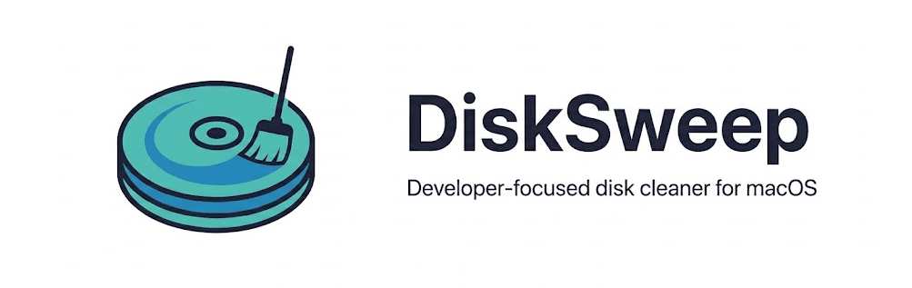

  

  <strong>Developer-focused disk cleaner for macOS</strong> 
  Scan for developer caches, duplicate files, and large forgotten files. Visualize disk usage and reclaim space with one click.

  
  
  
  

  
  
  
  
  

  
  

  Built with Swift and SwiftUI. No Electron, no web views, no bloat.

---

## Download

Download the latest version from [**Releases**](https://github.com/beyondthecode-bc/DiskSweep/releases/latest). Unzip, move `DiskSweep.app` to Applications, and launch.

The app includes a built-in update checker — open **About** and click **Check Now** to see if a newer version is available.

## Features

### Cache Scanner
- **20 developer & system cache categories** — Xcode DerivedData, Device Support, Simulators, Swift Packages, Homebrew, CocoaPods, npm, Docker, pip, Gradle, Cargo, Composer, browser caches, system logs, crash reports, and more
- **One-click cleanup** — move cache files to Trash safely (always recoverable)
- **Batch cleanup** — multi-select with checkboxes and "Clean All Caches" button
- **Incremental re-scan** — mtime tracking skips unchanged categories for faster rescans
- **Smart recommendations** — prioritized suggestions by potential savings

### Duplicate Detection
- **6-stage progressive pipeline** — size grouping, inode dedup, prefix hash, suffix hash, full SHA-256, APFS clone detection
- **Smart selection** — automatically suggests which copies to remove (keeps originals in Documents, removes duplicates in Downloads)
- **Swap toggle** — click any file in a group to swap which copy is marked for removal
- **APFS clone awareness** — detects copy-on-write clones that share physical storage (0 bytes reclaimable)
- **Parallel hashing** — uses all CPU cores for fast duplicate scanning

### Large File Finder
- **Configurable threshold** — find files above 100 MB, 250 MB, 500 MB, or 1 GB
- **Old downloads detection** — surfaces forgotten files in Downloads older than your chosen age (7–90 days)
- **Batch cleanup** — select multiple files and move to Trash in one action

### Analysis Window (8 tabs)
- **Overview** — disk usage donut chart, file type breakdown, summary cards, and export button
- **Caches** — all cache categories with individual clean buttons
- **Duplicates** — grouped duplicate files with search, sort, and batch delete
- **Large Files** — threshold picker with old downloads and search/sort
- **Space Explorer** — ranked directory list with proportional size bars and click-to-reveal in Finder
- **Xcode** — per-project DerivedData, simulators, device support, archives with individual cleanup
- **Dev Tools** — Docker, Homebrew, and node_modules cleanup

### Export Reports
- **PDF** — professional report with app logo, disk usage bar, color-coded cache bars, large files, and duplicates summary
- **Excel (CSV)** — structured spreadsheet with UTF-8 BOM for Excel compatibility
- **Text** — human-readable plain text report

### General
- **Menu bar app** — quick access with disk usage bar, percentage, and smart recommendations
- **Built-in update checker** — checks GitHub Releases with one-click install (handles App Translocation)
- **8 languages** — English, French, German, Spanish, Japanese, Korean, Portuguese, Chinese
- **Zero dependencies** — pure Swift, no third-party libraries
- **Quick Look** — preview any file before deleting
- **Drag and drop** — drag files from the analysis window to Finder
- **Context menus** — right-click for Open, Reveal, Quick Look, Copy Path, Delete
- **Keyboard shortcuts** — Cmd+R rescan, Cmd+Shift+F full scan, Cmd+, settings
- **Search and sort** — filter files by name/path, sort by size/name/date
- **Scheduled auto-scan** — daily or weekly background scans with notifications
- **Scan history** — tracks total reclaimed space over the lifetime of the app
- **Recently cleaned** — see what was last cleaned in the popover
- **Onboarding** — first-launch welcome screen with feature overview and Full Disk Access setup
- **Accessibility** — VoiceOver labels and hints on all interactive elements

## Requirements

| | Requirement |
|---|---|
| **OS** | macOS 14.0 (Sonoma) or later |
| **Chip** | Any Mac (Apple Silicon or Intel) |
| **Recommended** | Grant Full Disk Access for complete scanning |

## Getting Started

### 1. Download and install

Download the latest `.zip` from [Releases](https://github.com/beyondthecode-bc/DiskSweep/releases/latest), extract it, and move `DiskSweep.app` to your Applications folder.

### 2. Grant Full Disk Access (recommended)

For the most complete scan results, grant Full Disk Access:

1. Open **System Settings > Privacy & Security > Full Disk Access**
2. Click the **+** button and add `DiskSweep.app`

The app works without this permission but will skip protected directories.

### 3. Scan and clean

Click the disk icon in the menu bar, then **Scan Now** to find reclaimable space. Use **Open Analysis** for the full tabbed interface with duplicate detection, large file finder, and space explorer.

## Translations

This repository hosts the translation files for DiskSweep. You can help translate the app into your language or improve existing translations.

### How to contribute

1. Fork this repository
2. Edit an existing file in the [`languages/`](languages/) folder, or create a new one by copying `English.xml`
3. Translate the string values (the text between `<string>` tags) — **do not** change the `key` attributes
4. Keep any `%1`, `%2`, `%@`, `%d` placeholders in place — the app needs them
5. Submit a pull request

### Current languages

| Language | File | Status |
|---|---|---|
| English | [`English.xml`](languages/English.xml) | Complete |
| French | [`French.xml`](languages/French.xml) | Complete |
| German | [`German.xml`](languages/German.xml) | Complete |
| Spanish | [`Spanish.xml`](languages/Spanish.xml) | Complete |
| Japanese | [`Japanese.xml`](languages/Japanese.xml) | Complete |
| Korean | [`Korean.xml`](languages/Korean.xml) | Complete |
| Portuguese (BR) | [`Portuguese.xml`](languages/Portuguese.xml) | Complete |
| Chinese (Simplified) | [`Chinese.xml`](languages/Chinese.xml) | Complete |

Want to add a new language? Copy `English.xml`, rename it to your language name, translate the values, and submit a PR.

## Bug Reports & Feature Requests

Please use [Issues](../../issues) to report bugs or request features.

## Support the Project

If DiskSweep is useful to you, consider supporting development:

  
  &nbsp;&nbsp;&nbsp;
  

---

## Troubleshooting

### "DiskSweep" Not Opened — Gatekeeper warning

DiskSweep is not yet notarized with Apple. On first launch you may see a Gatekeeper warning.

**To fix this:**

1. Click **Done** to dismiss the dialog
2. Open **System Settings > Privacy & Security**
3. Scroll down — you'll see a message that DiskSweep was blocked
4. Click **Open Anyway**

This only needs to be done once. After that, the app will open normally.

### Administrator password required when installing an update

When you click **Install Now** in the About window, macOS will show a password prompt before replacing the app in `/Applications`. This is expected — the app needs elevated permissions to overwrite itself.
